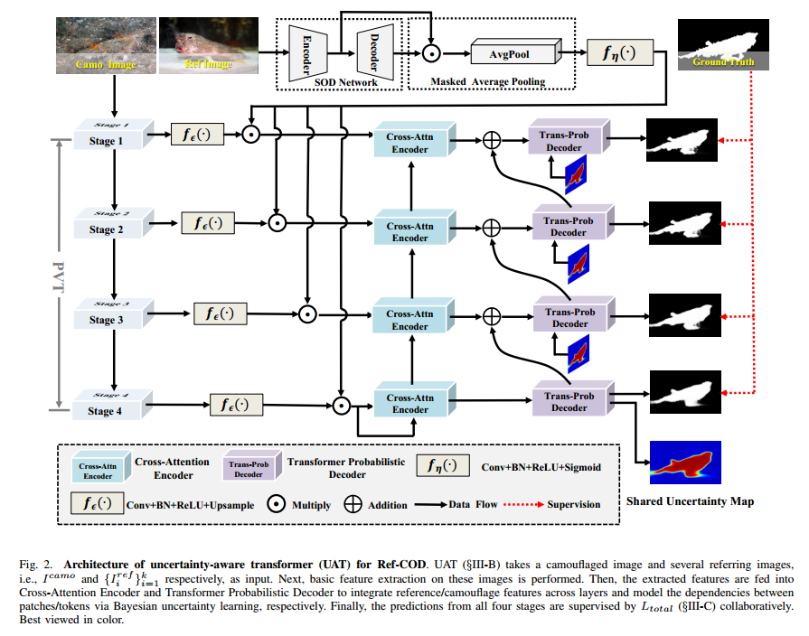

# Uncertainty-Aware Transformer for Referring Camouflaged Object Detection

  
   Figure.1 The overall architecture of the proposed UATNet for referring camouflaged bbject detection. 

# 1.Requirements
Python v3.6, Pytorch 0.4.0+, Cuda 10.0, TensorboardX 2.0, opencv-python

#2.Data Preparation
Please visiting xxx for training and testing data. Thanks for xxx.

#3.Training & Testing
The source code will be made publicly available soon, please waiting...

#4.Results
* **Qualitative comparison**

  
Table.1 Quantitative comparison with some SOTA models on referring camouflaged bbject detection benchmark datasets. 

