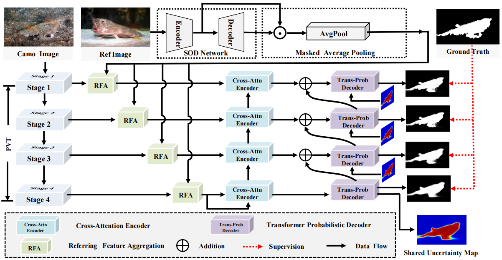

# Uncertainty-Aware Transformer for Referring Camouflaged Object Detection [TIP2025]

Authors: Ranwan Wu, [Tian-Zhu Xiang](https://scholar.google.com/citations?user=5uQEWX0AAAAJ&hl=en&oi=ao), [Guo-Sen Xie](https://scholar.google.com/citations?user=LKaWa9gAAAAJ&hl=en&oi=ao), [Rongrong Gao](https://scholar.google.com/citations?user=MwdwZ_kAAAAJ&hl=en&oi=ao), [Xiangbo Shu](https://scholar.google.com/citations?user=FQfcm5oAAAAJ&hl=en&oi=ao), [Fang Zhao](https://scholar.google.com/citations?hl=en&user=4C7mvOwAAAAJ) and [Ling Shao](https://scholar.google.com/citations?user=z84rLjoAAAAJ&hl=en&oi=ao)

Welcome to the official PyTorch implementation repository of our paper **Uncertainty-Aware Transformer for Referring Camouflaged Object Detection**, accepted to IEEE TIP 2025.

# Framework
  
   Figure.1 The overall architecture of the proposed UAT for referring camouflaged 0bject detection.

# Requirements
Python v3.6, Pytorch 0.4.0+, Cuda 10.0, TensorboardX 2.0, opencv-python

# Data Preparation
### Please visiting [RefCOD](https://github.com/zhangxuying1004/RefCOD) for training and testing data. Thanks for their contributions.

# Training
- Download the training and testing dataset, and place them in the *dataset* floder.
- Download the pre-trained weights of pvtv2 [here](https://pan.baidu.com/s/1etvyFSv9nFrWKHxwHcSHJA?pwd=2025)[code:2025], and place them in the *pvt_weights* floder.
- Run python train.py to train the model.

# Testing

# 4.Results
* **Qualitative comparison**

  
Table.1 Quantitative comparison with some SOTA models on referring camouflaged bbject detection benchmark datasets. 

* **Salmaps**
The salmaps of the above datasets can be download from [BaiDu](https://pan.baidu.com/s/1Fz_MK2ABmXU6T1Oro-btCw)[code:NUST] or [Google](https://drive.google.com/file/d/1fITY74Bgdy0ps-7ruFajibEyy6qRNZHH/view?usp=sharing).
